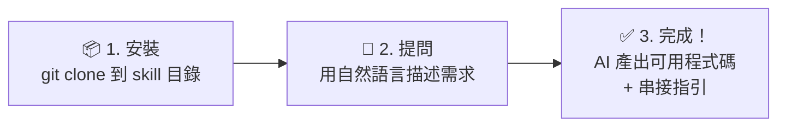

# ECPay Skill — 綠界科技 AI 整合助手

> **綠界科技官方出品** — 由 ECPay 團隊開發與維護，內容與 API 同步更新。

**當前版本：v2.21**

## 前置需求

使用本 Skill 需要以下任一 AI 編程助手：

| 平台 | 需求 |
|------|------|
| Claude Code | Claude Pro / Max / Team / Enterprise 訂閱 |
| GitHub Copilot CLI | GitHub Copilot Pro 以上訂閱（Free 方案不含 CLI） |
| Cursor | Cursor Pro / Teams 訂閱 |
| Windsurf | Windsurf Pro / Teams 訂閱 |
| OpenAI Custom GPTs | ChatGPT Plus / Pro / Business / Enterprise / Edu |
| OpenClaw | OpenClaw 安裝（開源免費，需 Node ≥22） |

## 這是什麼？

ECPay Skill 是一個 **AI Skill 套件**——安裝到 AI 編程助手（Claude Code、GitHub Copilot CLI、OpenClaw、**OpenAI Custom GPTs** 等）後，AI 就能根據你的需求，直接生成綠界 API 串接程式碼、診斷錯誤、引導完整串接流程。

不需要自己翻文件，用自然語言描述需求即可。

### AI 編程助手是什麼？

AI 編程助手是安裝在開發者電腦上（終端機或程式碼編輯器內）的 AI 工具，能讀取專案程式碼、用自然語言對話、直接生成或修改程式碼。它不是瀏覽器裡的 ChatGPT——而是嵌入開發工作流程的專業工具。上方「前置需求」表格列出的 Claude Code、GitHub Copilot CLI、Cursor、Windsurf 等都屬於這類工具。

### AI Skill 是什麼？

打個比方：AI 編程助手就像一個**聰明但對你的業務一無所知的新進工程師**。AI Skill 就是交給他的「**工作手冊**」——安裝 ECPay Skill 後，這個 AI 就變成了熟悉綠界全系列 API 的串接專家。

技術上，AI Skill 是一組 Markdown 文件（入口為 SKILL.md），包含決策樹、整合指南、加密範例和官方 API 索引。AI 偵測到 ECPay 相關關鍵字時會自動啟動，依據這些知識回答問題。

### 💼 給管理決策者

| 常見疑問 | 說明 |
|---------|------|
| **為什麼不直接看官方文件？** | 傳統做法：工程師逐頁翻 API 文件 → 理解規格 → 寫程式 → 除錯來回。安裝本 Skill 後：用中文描述需求 → AI 直接產出可用程式碼 + 串接指引，大幅縮短串接週期 |
| **安全嗎？** | 本 Skill 是**純文字知識檔**（Markdown），不含可執行程式、不收集任何資料、不連線至第三方伺服器。密鑰由開發者自行管理，從不寫入 Skill 檔案 |
| **程式碼品質有保障嗎？** | 所有範例基於**綠界官方 PHP SDK**（134 個驗證範例），API 規格透過 `references/` 即時連結官網最新版本，不依賴過期文件 |
| **需要額外付費嗎？** | 本 Skill 免費（CC BY-SA 4.0 授權）。唯一費用是 AI 編程助手本身的訂閱費（見上方「前置需求」表格），以及綠界的交易手續費 |

### 這個 Skill 能做什麼？

| 能力 | 說明 |
|------|------|
| **需求分析** | 根據你的場景（電商、訂閱、門市、直播等）推薦最適合的 ECPay 方案 |
| **程式碼生成** | 基於 134 個驗證過的 PHP 範例，翻譯為 12 種主流語言（或其他語言） |
| **即時除錯** | 診斷 CheckMacValue 失敗、AES 解密錯誤、API 錯誤碼等串接問題 |
| **完整流程** | 引導收款 → 發票 → 出貨的端到端整合 |
| **上線檢查** | 逐項檢查安全性、正確性、合規性 |

## 快速開始



> 💡 **給非技術人員**：安裝後你不需要懂程式。只要用中文告訴 AI「我要信用卡收款」，它就會產出完整的程式碼和步驟說明，交給工程師即可。

### 1. 安裝

**Claude Code**
```bash
git clone https://github.com/erictseng618/ecpay-skill.git ~/.claude/skills/ecpay
```

**GitHub Copilot CLI / VS Code Copilot**
```bash
# 專案層級（推薦，團隊共用，提交至 repo）
git clone https://github.com/erictseng618/ecpay-skill.git .github/skills/ecpay

# 或個人全域安裝
git clone https://github.com/erictseng618/ecpay-skill.git ~/.copilot/skills/ecpay
```

**Cursor**
```bash
# Cursor 使用專案根目錄的 .cursor/skills/ 目錄
git clone https://github.com/erictseng618/ecpay-skill.git .cursor/skills/ecpay
```

**Windsurf**
```bash
# Windsurf 使用專案根目錄的 .windsurf/skills/ 目錄
git clone https://github.com/erictseng618/ecpay-skill.git .windsurf/skills/ecpay
```

**OpenClaw**
```bash
git clone https://github.com/erictseng618/ecpay-skill.git ~/.openclaw/skills/ecpay
```

**OpenAI Custom GPTs（ChatGPT Plus/Pro/Business/Enterprise/Edu）**
1. 開啟 [GPT 編輯器](https://chatgpt.com/gpts/editor)
2. 將 `SKILL_OPENAI.md` 內容貼入 Instructions 欄位（GPT Builder 限制 8,000 字元，本檔案已控制在此上限內）
3. 依 [`OPENAI_SETUP.md`](./OPENAI_SETUP.md) 的建議清單上傳 Knowledge Files（最多 20 個檔案）
4. 詳細步驟見 [`OPENAI_SETUP.md`](./OPENAI_SETUP.md)

**其他框架**：將此資料夾放入框架的 skill 目錄。

### 驗證安裝

安裝完成後，在 AI 助手中輸入以下測試問題，確認 Skill 正確載入：

> 「用 ECPay AIO 串接信用卡付款，需要哪些步驟？」

若 AI 回應中提到「CheckMacValue」或引用了 `guides/01`，表示 Skill 運作正常。若 AI 僅給出通用建議而未提及 ECPay 特定步驟，請檢查安裝路徑是否正確。

### 2. 使用

安裝後，在 AI 助手中直接用自然語言提問。提到 ECPay 相關關鍵字時 Skill 會自動啟動：

> ecpay, 綠界, 信用卡串接, 超商取貨, 電子發票, CheckMacValue, 站內付, 金流串接, 物流串接, 定期定額, 綁卡, 退款, 折讓...

**Claude Code 快速指令**（選用）：將 `commands/` 內的 `.md` 檔複製到專案 `.claude/commands/`，即可使用以下 6 個快速指令：

| 指令 | 用途 |
|------|------|
| `/ecpay-pay` | 串接金流（AIO / ECPG / 幕後授權）、查詢、退款、Callback |
| `/ecpay-invoice` | 串接電子發票（B2C / B2B / 離線） |
| `/ecpay-logistics` | 串接物流（國內 / 全方位 / 跨境） |
| `/ecpay-ecticket` | 串接電子票證（價金保管 / 純發行） |
| `/ecpay-debug` | 除錯排查 + CheckMacValue/AES 加密驗證 |
| `/ecpay-go-live` | 上線前檢查清單 |

### 3. 使用範例

> 💡 **提示**：如果你同時安裝了多個支付服務的 Skill（如 TapPay、LinePay 等），
> 請在提問時加上「**ECPay**」或「**綠界**」，確保 AI 使用正確的 Skill。

#### 金流 — AIO 全方位金流

```
「幫我用 Go 寫一個完整的 ECPay AIO 信用卡一次付清串接」
→ AI 生成含 CheckMacValue 計算、表單送出、Callback 驗證的完整範例（guides/01）

「我想用綠界 AIO 提供 ATM 虛擬帳號付款，Python Flask」
→ AI 生成取號 + 輪詢/Callback 確認付款的完整流程（guides/01）

「用 TypeScript 串接綠界超商代碼繳費」
→ AI 生成超商代碼取號 + Callback 處理，提醒 RtnCode=10100073 是正常取號成功（guides/01）

「我的 SaaS 要用 ECPay 做定期定額訂閱扣款，Java Spring Boot」
→ AI 生成 AIO 定期定額參數、首期交易、後續自動扣款的 Callback 處理。
  ⚠️ 連續扣款失敗 6 次將自動取消合約（不可恢復），需設定 PeriodReturnURL 接收通知（guides/01 §定期定額）

「綠界信用卡分期付款怎麼串？C# ASP.NET」
→ AI 生成含分期期數設定的 AIO 串接，說明 3/6/12/18/24/30 期的參數差異。
  ⚠️ 可用期數依合約與發卡行而定；「消費者自費分期」需另向綠界申請啟用（guides/01）

「想在我的網站加上 ECPay BNPL 先買後付，Ruby on Rails」
→ AI 說明 BNPL 限制，生成 ChoosePayment=BNPL 的完整範例。
  ⚠️ 最低消費 3,000 元、需另向綠界申請啟用 BNPL 服務（guides/01）
```

#### 金流 — 站內付 2.0

```
「我要用 Node.js 串接綠界信用卡付款，前後端分離 React 架構」
→ AI 推薦站內付 2.0，生成前端 Token + 後端建立交易的完整 TypeScript 程式碼（guides/02）

「ECPay 站內付綁卡快速付款怎麼做？Vue + Express」
→ AI 生成首次綁卡 + Token 儲存 + 後續免輸入卡號扣款的完整流程。
  ⚠️ 信用卡綁定僅限「代收付」合約模式，「新型閘道」模式不支援（guides/02 §綁卡）

「我的 iOS App 要串接綠界信用卡付款」
→ AI 推薦站內付 2.0 App 方案，提醒 SDK 版本需求與雙 Domain 規則（guides/02 + guides/24）
```

#### 金流 — 幕後授權 / 查詢 / 退款

```
「後台自動扣款不需要消費者操作畫面，ECPay 怎麼做？Kotlin」
→ ⚠️ 幕後授權需取得 PCI-DSS SAQ-D 認證方可申請使用。
  AI 應先確認開發者是否已具備 PCI-DSS 資格，若無則引導至 ECPG 綁卡扣款等替代方案（guides/03）

「怎麼用 Python 查詢綠界 AIO 訂單狀態？」
→ AI 生成 QueryTradeInfo API 呼叫 + 回應解析範例（guides/01 §QueryTradeInfo）

「客戶要求退款，ECPay 信用卡退款怎麼串？Node.js」
→ AI 區分當日取消（Action=N）vs 請退（Action=R），生成 DoAction 完整範例（guides/01 §DoAction）
```

#### 電子發票

```
「用 Python 串接綠界 B2C 電子發票開立」
→ AI 生成 AES 加密 + 開立/作廢/折讓的完整流程（guides/04）

「我們公司對公司交易，要用 ECPay 開 B2B 電子發票，Java」
→ AI 說明交換模式 vs 存證模式差異，生成 B2B 發票開立範例（guides/05）

「綠界發票折讓怎麼做？消費者部分退貨需要開折讓」
→ AI 生成折讓 API 呼叫，說明折讓金額規則（guides/04 §Allowance）
```

#### 物流

```
「我要用 C# 串接 ECPay 超商取貨付款（7-11 / 全家）」
→ AI 生成建立物流訂單 + 門市地圖選擇 + 物流狀態 Callback 的完整範例（guides/06）

「用 Go 串接綠界宅配物流，需要列印託運單」
→ AI 生成宅配訂單建立 + 列印託運單 URL 取得範例（guides/06）

「ECPay 跨境物流怎麼串？要寄到香港和馬來西亞」
→ AI 生成 AES-JSON 跨境物流 API 串接，說明支援國家與限制（guides/08）
```

#### 電子票證

```
「我們要用綠界做演唱會電子票券，Rust」
→ AI 說明 AES-JSON + CMV 雙重驗證機制（與 AIO 公式不同），生成票券發行+核銷範例。
  ⚠️ 電子票證需向綠界獨立申請開通（非金流帳號自動包含），且使用獨立的 HashKey/HashIV（guides/09）
```

#### 跨服務整合

```
「我需要用綠界做完整電商：收款後自動開發票再出貨，Python Django」
→ AI 引導金流 + 發票 + 物流的跨服務串接流程，說明三組不同的 MerchantID/HashKey（guides/11）
```

#### 除錯與排查

```
「ECPay CheckMacValue 驗證一直失敗，錯誤碼 10400002」
→ AI 診斷加密流程，定位 URL encode 順序問題，提供 test-vectors 驗證（guides/13 + guides/15）

「綠界 AES 解密回來是亂碼，ECPG 站內付回呼解不開」
→ AI 檢查 Padding、Key/IV 長度、URL encode 差異，定位 AES vs CMV encode 混用問題（guides/14）

「ECPay Callback 一直收不到，我的 ReturnURL 設定正確啊」
→ AI 排查防火牆、HTTPS 憑證、回應格式（1|OK vs JSON），提供 Callback 失敗恢復策略（guides/22）

「綠界 ECPG 打 API 一直 404，Token 拿得到但建立交易失敗」
→ AI 定位 ECPG 雙 Domain 問題：Token API 走 ecpg、交易 API 走 ecpayment（guides/02 + guides/15）
```

#### 上線與環境切換

```
「綠界測試環境都通了，要怎麼安全切換到正式環境？」
→ AI 逐項引導上線檢查清單：替換 MerchantID/HashKey/HashIV、切換 Domain、驗證 Callback（guides/16）
```

#### 特殊場景

```
「門市要用 ECPay POS 刷卡機，怎麼串接？」
→ AI 說明 POS 串接規格與硬體需求（guides/17）

「直播賣東西想用綠界收款網址讓觀眾直接付款」
→ AI 說明直播收款 URL 產生方式與限制（guides/18）

「Apple Pay 可以用 ECPay 收嗎？Swift iOS App」
→ AI 說明 AIO ChoosePayment=ApplePay 或 ECPG 方式。注意：ECPay 不支援 Google Pay。
  ⚠️ Apple Pay 需：(1) Apple Developer Account + Payment Processing Certificate (2) 向綠界申請啟用
  (3) 僅限 iOS 原生 SDK（不支援 WebView / Android）（guides/01 / guides/02）
```

## 涵蓋服務

| 服務 | 內容 | 對應指南 |
|------|------|---------|
| **金流** | 全方位金流（AIO）、站內付 2.0、幕後授權、幕後取號 | guides/01-03 |
| **物流** | 國內物流（超商取貨 + 宅配）、全方位物流、跨境物流 | guides/06-08 |
| **電子發票** | B2C、B2B（交換 + 存證模式）、離線 | guides/04-05, 19 |
| **電子票證** | 價金保管（使用後核銷 / 分期核銷）、純發行 | guides/09 |
| **購物車** | WooCommerce、OpenCart、Magento、Shopify | guides/10 |
| **POS 刷卡機** | 實體門市刷卡機串接 | guides/17 |
| **直播收款** | 直播電商收款網址 | guides/18 |

### 支援的付款方式

信用卡一次付清、信用卡分期、信用卡定期定額、ATM 虛擬帳號、超商代碼、超商條碼、WebATM、TWQR、BNPL 先買後付、微信支付、Apple Pay、銀聯

## 特色

- **134 個**經官方驗證的 PHP 範例（可翻譯為 12 種主流語言或其他語言）
- **25 份**深度整合指南（從入門到上線）
- **12 種語言**的加密函式實作（Python、Node.js、TypeScript、Java、C#、Go、C、C++、Rust、Swift、Kotlin、Ruby）
- **19 份**官方 API 技術文件索引（共計 431 個 URL，可即時查閱原始文件）
- 決策樹自動推薦最適方案
- 跨服務整合場景（收款 + 發票 + 出貨）
- 內建除錯指南和上線檢查清單
- **即時規格更新**——AI 在產生程式碼前會透過 `references/` 即時讀取 `developers.ecpay.com.tw` 最新 API 規格，不依賴過期的靜態文件
- **6 個 Claude Code 快速指令**（`/ecpay-pay`、`/ecpay-invoice`、`/ecpay-debug` 等）

### 維護工具

- **`scripts/validate-ai-index.sh`**：驗證 guides/13、14、24 中的 AI Section Index 行號是否準確（確認行號指向的行為 `#` 開頭的標題）。維護者更新這些 guide 的章節結構後建議執行此腳本確認行號索引無誤。

### HTTP 協議模式

ECPay API 使用不同的認證和請求格式，本 Skill 完整涵蓋：

| 模式 | 認證方式 | 請求格式 | 適用服務 |
|------|---------|---------|---------|
| **CMV-SHA256** | CheckMacValue + SHA256 | Form POST | AIO 金流 |
| **AES-JSON** | AES-128-CBC 加密 | JSON POST | ECPG、電子發票、全方位/跨境物流 |
| **AES-JSON + CMV** | AES-128-CBC + CheckMacValue（SHA256） | JSON POST | 電子票證（CMV 公式與 AIO 不同） |
| **CMV-MD5** | CheckMacValue + MD5 | Form POST | 國內物流 |

## 指南索引

### 入門與全覽

| # | 檔案 | 主題 |
|---|------|------|
| 00 | guides/00-getting-started.md | 從零開始：第一筆交易到上線 |
| 11 | guides/11-cross-service-scenarios.md | 跨服務整合場景（收款+發票+出貨） |

### 金流

| # | 檔案 | 主題 |
|---|------|------|
| 01 | guides/01-payment-aio.md | 全方位金流 AIO（20 個 PHP 範例） |
| 02 | guides/02-payment-ecpg.md | 站內付 2.0 ECPG（24 個 PHP 範例） |
| 03 | guides/03-payment-backend.md | 幕後授權 + 幕後取號 |
| 17 | guides/17-pos-integration.md | POS 刷卡機串接指引 |
| 18 | guides/18-livestream-payment.md | 直播收款指引 |

### 電子發票

| # | 檔案 | 主題 |
|---|------|------|
| 04 | guides/04-invoice-b2c.md | B2C 電子發票（19 個 PHP 範例） |
| 05 | guides/05-invoice-b2b.md | B2B 電子發票（23 個 PHP 範例） |
| 19 | guides/19-invoice-offline.md | 離線電子發票指引 |

### 物流

| # | 檔案 | 主題 |
|---|------|------|
| 06 | guides/06-logistics-domestic.md | 國內物流（24 個 PHP 範例） |
| 07 | guides/07-logistics-allinone.md | 全方位物流（16 個 PHP 範例） |
| 08 | guides/08-logistics-crossborder.md | 跨境物流（8 個 PHP 範例） |

### 其他服務

| # | 檔案 | 主題 |
|---|------|------|
| 09 | guides/09-ecticket.md | 電子票證 |
| 10 | guides/10-cart-plugins.md | 購物車模組 |

### 跨領域技術參考

| # | 檔案 | 主題 |
|---|------|------|
| 12 | guides/12-sdk-reference.md | PHP SDK 完整參考 |
| 13 | guides/13-checkmacvalue.md | CheckMacValue 解說 + 12 語言實作 |
| 14 | guides/14-aes-encryption.md | AES 加解密解說 + 12 語言實作 |
| 20 | guides/20-http-protocol-reference.md | HTTP 協議參考（跨語言必讀） |
| 21 | guides/21-error-codes-reference.md | 全服務錯誤碼集中參考 |
| 22 | guides/22-webhook-events-reference.md | 統一 Callback/Webhook 參考 |

### 程式語言規範（guides/lang-standards/）

> 生成非 PHP 程式碼時，AI 同時載入目標語言的規範檔。涵蓋命名慣例、型別定義、錯誤處理、HTTP 配置、Callback Handler 模板、URL Encode 注意事項。

| 語言 | 檔案 |
|------|------|
| Python | guides/lang-standards/python.md |
| Node.js | guides/lang-standards/nodejs.md |
| TypeScript | guides/lang-standards/typescript.md |
| Go | guides/lang-standards/go.md |
| Java | guides/lang-standards/java.md |
| C# | guides/lang-standards/csharp.md |
| Kotlin | guides/lang-standards/kotlin.md |
| Ruby | guides/lang-standards/ruby.md |
| Rust | guides/lang-standards/rust.md |
| Swift | guides/lang-standards/swift.md |
| C | guides/lang-standards/c.md |
| C++ | guides/lang-standards/cpp.md |

### 運維與上線

| # | 檔案 | 主題 |
|---|------|------|
| 15 | guides/15-troubleshooting.md | 除錯指南 + 錯誤碼 + 常見陷阱 |
| 16 | guides/16-go-live-checklist.md | 上線檢查清單 |
| 23 | guides/23-performance-scaling.md | 效能與擴展性指引 |
| 24 | guides/24-multi-language-integration.md | 多語言整合（Go/Java/C#/TS/Kotlin/Ruby E2E + Mobile App） |

## 目錄結構

```
ecpay-skill/
├── SKILL.md                    # AI 進入點：決策樹 + 導航（Claude Code / Copilot CLI / Cursor / Windsurf / OpenClaw）
├── SKILL_OPENAI.md             # OpenAI Custom GPTs System Instructions
├── OPENAI_SETUP.md             # OpenAI GPTs 建置指南
├── README.md                   # 本文件
├── CONTRIBUTING.md             # 貢獻指南
├── LICENSE                     # CC BY-SA 4.0 License
├── .github/                    # GitHub 社群模板（Issue/PR 模板、CI workflow）
├── test-vectors/               # 跨語言加密驗證用測試向量（CMV + AES）
├── commands/                   # Claude Code 快速指令（6 個 /ecpay-* 指令）
├── guides/                     # 25 份深度整合指南（OpenAI GPTs 依 OPENAI_SETUP.md 選擇上傳子集）
│   └── lang-standards/         # 12 語言程式規範（Python/Node.js/TS/Go/Java/C#/Kotlin/Ruby/Rust/Swift/C/C++）
├── references/                 # 官方 API 文件 URL 索引（19 個檔案，431 個 URL）— AI 即時讀取入口
│   ├── Payment/   (8 個)
│   ├── Invoice/   (4 個)
│   ├── Logistics/ (3 個)
│   ├── Ecticket/  (3 個)
│   └── Cart/      (1 個)
└── scripts/
    ├── validate-ai-index.sh    # AI Section Index 行號驗證腳本
    └── SDK_PHP/                # 官方 PHP SDK + 134 個範例
        └── example/
            ├── Payment/Aio/        (20 個)
            ├── Payment/Ecpg/       (24 個)
            ├── Invoice/B2C/        (19 個)
            ├── Invoice/B2B/        (23 個)
            ├── Logistics/Domestic/ (24 個)
            ├── Logistics/AllInOne/ (16 個)
            └── Logistics/CrossBorder/ (8 個)
```

## AI 查詢處理流程：guides/ 與 references/ 的參照順序

AI 助手在回答開發者問題時，依循以下順序參照知識庫：

### 第一層：SKILL.md 決策樹（路由）

```
開發者提問 → SKILL.md 決策樹分析需求
  ├── 判斷服務類型（金流 / 物流 / 發票 / 票證）
  ├── 判斷協議模式（CMV-SHA256 / AES-JSON / CMV-MD5）
  └── 路由到對應的 guide + reference
```

### 第二層：guides/（靜態整合知識）

```
guides/XX-*.md  →  了解「怎麼做」
  ├── 整合流程與架構邏輯
  ├── 程式碼範例與常見陷阱
  └── 參數表（標記為 SNAPSHOT，僅供理解用）
```

### 第三層：references/（即時 API 規格）

```
references/*/  →  取得「最新規格」
  ├── 讀取 reference 檔案 → 找到對應 URL
  ├── 使用平台工具存取 developers.ecpay.com.tw
  └── 取得最新端點、參數定義、回應格式
```

### 完整查詢流程

```
1. SKILL.md 決策樹  ──→  判斷需求，路由到對應 guide
2. guides/XX         ──→  讀取整合流程、架構邏輯、注意事項
3. scripts/SDK_PHP/  ──→  讀取官方 PHP 範例作為翻譯基礎（需要產生程式碼時）
4. references/       ──→  ⭐ 即時存取最新 API 規格（產生程式碼前必做）
5. guides/13 或 14   ──→  加密實作參考（CheckMacValue 或 AES）
6. test-vectors/     ──→  提供測試向量供驗證
```

> **核心原則**：`guides/` 告訴 AI「怎麼串接」，`references/` 告訴 AI「串接什麼」。
> 產生 API 呼叫程式碼前，**必須**透過 `references/` 取得最新規格，不可僅依賴 `guides/` 中的 SNAPSHOT 參數表。

### 各平台存取 references/ 的方式

| 平台 | 存取工具 | 方式 |
|------|---------|------|
| Claude Code | `web_fetch` | 直接讀取 reference URL |
| GitHub Copilot CLI | `web_fetch` / `fetch` | 直接讀取 reference URL |
| Cursor | `@web` / Fetch MCP | 直接讀取 reference URL |
| Windsurf | `@web` / `@docs` | 直接讀取 reference URL |
| OpenClaw | `web_fetch` / `web_search` | 直接讀取 reference URL |
| OpenAI GPTs | Web Search | 以 `site:developers.ecpay.com.tw` + API 名稱搜尋 |

> **OpenAI GPTs 注意**：無法直接讀取 `references/` 中的 URL，改用 Web Search 搜尋官方文件。
> 若 Web Search 無法取得結果，以 `guides/` SNAPSHOT 為備援並標示「此為 SNAPSHOT，可能非最新版本」。

## 測試環境快速參考

> 完整測試帳號（MerchantID / HashKey / HashIV）、測試信用卡號、3D Secure 驗證碼等資訊，
> 請見 [guides/00-getting-started.md §測試帳號](./guides/00-getting-started.md) 或 AI 助手中直接詢問「ECPay 測試帳號」。

更多測試卡號見 [guides/00-getting-started.md](./guides/00-getting-started.md)。

## 常見問題

**Q：不用 PHP 可以嗎？**
A：可以。本 Skill 支援 12 種語言的加密函式實作，並提供 HTTP 協議參考（guides/20）讓其他語言也能從零實作。PHP 範例作為翻譯基底，AI 會自動轉換為你的目標語言。

**Q：AIO 和站內付 2.0 怎麼選？**
A：AIO 會跳轉到綠界付款頁，整合最簡單；站內付 2.0 讓消費者在你的網站內完成付款，適合前後端分離架構（React/Vue/Angular）。詳見 guides/01 和 guides/02。

**Q：Callback（付款通知）收不到怎麼辦？**
A：參考 guides/15 §2 排查流程 + guides/22 各服務 Callback 格式彙總。常見原因：URL 不可達、未回應 `1|OK`、防火牆擋 ECPay IP。

**Q：怎麼從測試環境切換到正式環境？**
A：參考 guides/16 上線檢查清單，逐項替換 MerchantID、HashKey/HashIV、API domain。

**Q：AI 生成的程式碼可以直接使用嗎？**
A：AI 基於 134 個官方驗證的 PHP 範例和 12 語言加密實作生成程式碼，品質高但仍建議人工驗證。特別是金額、加密邏輯、Callback 處理等關鍵路徑應搭配測試環境驗證。

**Q：API 規格更新時，AI 會讀到最新的嗎？**
A：會。`references/` 目錄存放 431 個指向 `developers.ecpay.com.tw` 的 URL 索引（不是靜態副本），AI 會即時讀取最新官方規格。OpenAI GPTs 因平台限制改以 Web Search 替代。

## 相關資源

- [綠界科技官網](https://www.ecpay.com.tw)
- [開發者文件](https://developers.ecpay.com.tw)
- [PHP SDK GitHub](https://github.com/ECPay/ECPayAIO_PHP)

## 驗證與來源

本 Skill 基於綠界科技官方 API 技術文件及官方 PHP SDK 開發。如需驗證內容準確性：

1. **API 規格**：比對 [developers.ecpay.com.tw](https://developers.ecpay.com.tw) 官方文件
2. **PHP SDK**：比對 [ECPay 官方 GitHub](https://github.com/ECPay/ECPayAIO_PHP) 的範例程式碼
3. **技術諮詢**：聯繫綠界科技 系統分析部 sysanalydep.sa@ecpay.com.tw 確認

## 聯繫我們

| 用途 | 聯繫方式 |
|------|---------|
| Skill 技術諮詢 | sysanalydep.sa@ecpay.com.tw（綠界科技 系統分析部）|
| API 技術支援 | techsupport@ecpay.com.tw |
| 客服專線 | (02) 2655-1775 |

## 貢獻

歡迎貢獻！詳見 [CONTRIBUTING.md](./CONTRIBUTING.md)。

## 已知限制

- 僅支援新台幣（TWD）
- references/ URL 索引需要網路連線才能即時讀取最新 API 規格
- OpenAI GPTs 無法直接讀取 references/ 檔案（透過 Web Search 替代，可靠性略低於 web_fetch 直讀）
- AI 翻譯品質可能因模型與語言組合而異，生成的程式碼片段應經人工驗證

## 授權

CC BY-SA 4.0 License — 詳見 [LICENSE](LICENSE)

使用或衍生本 Skill 時，需標明出處（Attribution）並以相同授權分享（ShareAlike）。
